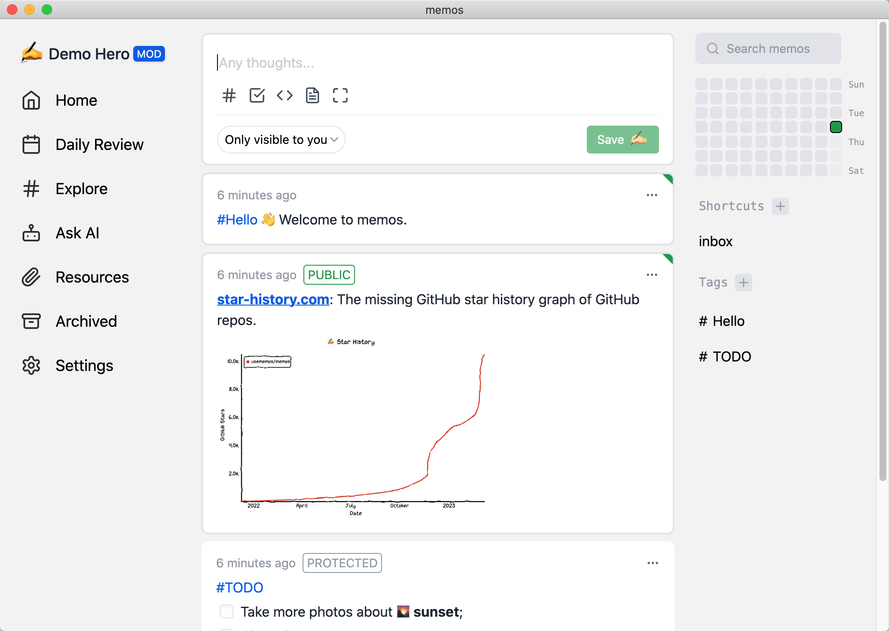

# memos-desktop

Memos client built on electron cross-end framework to meet special usage requirements.

## TODO
- [] Packaged cross-platform client (now MacOS only)
- [] Customizing the port and path to save data
- [] Automatic updates
- [] Customizing the Open API Path

Coming soon...

## Using people
- Local service, data is saved in the "My Documents" directory in the computer
- offline can be used
- General population wirelessly on the server

## Key points

- Open source and free forever
- Self-hosting with Docker in seconds
- Markdown support
- Customizable and sharable
- RESTful API for self-service

## Build windows env

- [Install GCC](https://jmeubank.github.io/tdm-gcc/articles/2021-05/10.3.0-release)
- CGO_ENABLED=1 go install github.com/mattn/go-sqlite3
- make w-build